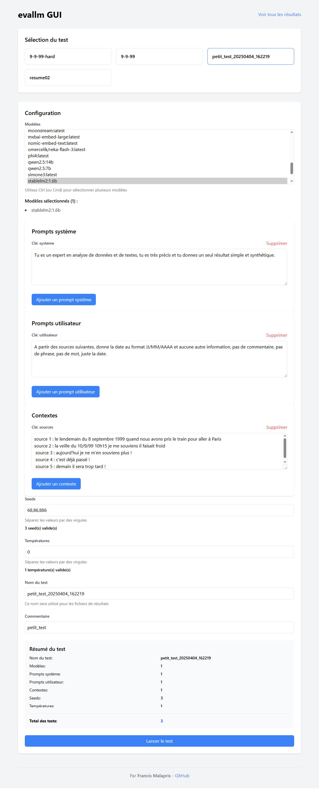

# evallm
[ ENGLISH BELOW]
Un outil pour évaluer et comparer les performances de modèles de langage avec Ollama.



## Français

### Description

evallm est un script Python conçu pour évaluer et comparer plusieurs modèles de langage (LLM) à l'aide d'Ollama. Il permet de tester différents modèles avec diverses configurations (prompts système, prompts utilisateur, contextes, graines, températures) et de générer un rapport HTML interactif pour visualiser et comparer les résultats.

L'outil est particulièrement utile pour :
- Réaliser du tuning sur les prompts afin d'optimiser les réponses des modèles
- Sélectionner les valeurs de température les plus adaptées à votre cas d'usage
- Comparer objectivement différents modèles afin de choisir celui qui correspond le mieux à vos attentes et besoins spécifiques
- Évaluer la cohérence des réponses avec différentes graines aléatoires

### Installation

#### Prérequis

- Python 3.6 ou supérieur
- [Ollama](https://ollama.ai/) installé et configuré sur votre système

#### Installation des dépendances

```bash
pip install -r requirements.txt
```

### Utilisation

Pour exécuter une évaluation, utilisez la commande suivante :

```bash
python scripts/evallm.py config.json
```

Où `config.json` est votre fichier de configuration contenant les paramètres d'évaluation.

Options disponibles :
- `--output` ou `-o` : Spécifier un nom de fichier pour le rapport HTML de sortie
- `--debug` : Activer le mode debug pour obtenir plus d'informations dans les logs

### Interface graphique (evallm-gui)

evallm dispose d'une interface graphique web complète qui simplifie considérablement l'utilisation de l'outil et offre une expérience utilisateur optimale.

#### Lancement de l'interface graphique

```bash
python evallm-gui.py
```

L'interface est accessible via votre navigateur à l'adresse http://localhost:8000.

#### Avantages de l'interface graphique

- **Productivité améliorée** : Configuration des tests en quelques clics sans avoir à éditer manuellement des fichiers JSON
- **Visualisation en temps réel** : Suivi de la progression des tests et consultation immédiate des résultats
- **Accessibilité** : Interface intuitive adaptée aux utilisateurs techniques et non-techniques
- **Itération rapide** : Capacité à ajuster et relancer des tests facilement pour affiner les configurations
- **Organisation** : Stockage et accès centralisé à l'historique de tous les tests et leurs résultats
- **Prévisualisation** : Estimation du nombre total de tests générés avant lancement
- **Flexibilité** : Importation et exportation des configurations pour partage ou sauvegarde

#### Caractéristiques principales

- **Tableau de bord** : Vue d'ensemble des modèles disponibles et des tests récents
- **Éditeur de prompts** : Interface riche pour créer et modifier les prompts système et utilisateur
- **Gestion des modèles** : Sélection multiple de modèles avec informations détaillées
- **Paramétrage avancé** : Configuration fine des seeds, températures et autres paramètres
- **Suivi des tests** : Visualisation de la progression et des temps d'exécution
- **Explorateur de résultats** : Navigation interactive dans les rapports générés
- **Comparaison visuelle** : Mise en évidence des différences entre modèles

#### Utilisation détaillée

1. **Configuration initiale**
   - Lancez l'interface avec `python evallm-gui.py`
   - L'application détecte automatiquement les modèles installés via Ollama
   - Consultez les tests préconfigurés ou commencez un nouveau test

2. **Création d'un test**
   - Sélectionnez les modèles à comparer dans la liste déroulante (sélection multiple possible)
   - Ajoutez des prompts système en cliquant sur "Ajouter un prompt système"
   - Définissez vos prompts utilisateur qui serviront de requêtes pour les tests
   - Ajoutez des contextes si nécessaire pour fournir des informations supplémentaires aux modèles
   - Configurez les valeurs de seeds (graines) pour assurer la reproductibilité
   - Définissez les températures pour tester différents niveaux de créativité

3. **Exécution et analyse**
   - Nommez votre test et ajoutez un commentaire descriptif si souhaité
   - Vérifiez le résumé qui indique le nombre total de tests à exécuter
   - Lancez le test en cliquant sur "Lancer le test"
   - Suivez la progression en temps réel
   - Accédez au rapport HTML généré pour analyser les résultats
   - Comparez les différentes réponses et performances entre modèles
   - Exportez ou partagez les résultats via les liens générés

L'interface graphique s'avère particulièrement utile pour les chercheurs, développeurs et équipes travaillant sur l'optimisation de prompts, la sélection de modèles ou l'évaluation comparative des performances de différents LLMs.

### Format du fichier de configuration

Le fichier de configuration est au format JSON et définit tous les paramètres pour l'évaluation :

```json
{
    "models": ["llama3", "mistral"],
    "system_prompts": {
        "standard": "Tu es un assistant IA utile et précis.",
        "from_file": "prompts/system_expert.txt"
    },
    "user_prompts": {
        "question1": "Explique-moi la photosynthèse",
        "from_file": "prompts/question_complex.txt"
    },
    "contexts": {
        "none": "",
        "from_file": "contexts/biology_context.txt"
    },
    "seeds": [42, 123],
    "temperatures": [0.0, 0.7],
    "commentaire": "<div><h3>Titre du rapport</h3><p>Description du test réalisé</p></div>",
    "resultats": ["réponse à surligner 1", "réponse à surligner 2"]
}
```

#### Explication des champs :

- `models` : Liste des modèles Ollama à évaluer
- `system_prompts` : Dictionnaire des prompts système à utiliser
- `user_prompts` : Dictionnaire des prompts utilisateur à tester
- `contexts` : Dictionnaire des contextes à fournir
- `seeds` : Liste des graines aléatoires pour la reproductibilité
- `temperatures` : Liste des températures à tester
- `commentaire` : Texte HTML/texte brut à afficher en haut du rapport (facultatif)
- `resultats` : Liste des réponses à surligner dans le rapport (facultatif)

Note : Pour les prompts et contextes, vous pouvez fournir directement le texte ou spécifier un chemin vers un fichier.

### Fonctionnalités

- Évaluation comparative de plusieurs modèles LLM
- Visualisation des résultats dans un rapport HTML interactif
- Comparaison des réponses avec différentes graines pour évaluer la cohérence
- Navigation facile entre les différentes sections du rapport
- Exportation des résultats bruts au format JSON
- Mise en évidence de réponses spécifiques
- Affichage des temps de réponse et des statistiques de performance

### Exemple de rapport

Le rapport HTML généré inclut :
- Une synthèse des performances des modèles
- Les données d'entrée utilisées (prompts système, prompts utilisateur, contextes)
- Les résultats détaillés organisés par modèle, avec les réponses pour chaque graine
- La liste des modèles disponibles dans Ollama

---

## English

### Description

evallm is a Python script designed to evaluate and compare multiple language models (LLMs) using Ollama. It allows testing different models with various configurations (system prompts, user prompts, contexts, seeds, temperatures) and generates an interactive HTML report to visualize and compare the results.

The tool is particularly useful for:
- Performing prompt tuning to optimize model responses
- Selecting the most appropriate temperature values for your use case
- Objectively comparing different models to choose the one that best meets your specific expectations and needs
- Evaluating response consistency with different random seeds

### Installation

#### Prerequisites

- Python 3.6 or higher
- [Ollama](https://ollama.ai/) installed and configured on your system

#### Installing dependencies

```bash
pip install -r requirements.txt
```

### Usage

To run an evaluation, use the following command:

```bash
python scripts/evallm.py config.json
```

Where `config.json` is your configuration file containing the evaluation parameters.

Available options:
- `--output` or `-o`: Specify a filename for the output HTML report
- `--debug`: Enable debug mode for more detailed logs

### Graphical User Interface (evallm-gui)

evallm includes a comprehensive web-based graphical interface that significantly simplifies the tool's usage and provides an optimal user experience.

#### Launching the GUI

```bash
python evallm-gui.py
```

The interface is accessible via your browser at http://localhost:8000.

#### Advantages of the GUI

- **Enhanced Productivity**: Configure tests with a few clicks without manually editing JSON files
- **Real-time Visualization**: Monitor test progress and immediately view results
- **Accessibility**: Intuitive interface suitable for both technical and non-technical users
- **Rapid Iteration**: Easily adjust and relaunch tests to refine configurations
- **Organization**: Centralized storage and access to the history of all tests and their results
- **Preview**: Estimate the total number of tests generated before launching
- **Flexibility**: Import and export configurations for sharing or backup

#### Key Features

- **Dashboard**: Overview of available models and recent tests
- **Prompt Editor**: Rich interface for creating and modifying system and user prompts
- **Model Management**: Multiple model selection with detailed information
- **Advanced Parameters**: Fine configuration of seeds, temperatures, and other parameters
- **Test Monitoring**: Visualization of progress and execution times
- **Results Explorer**: Interactive navigation through generated reports
- **Visual Comparison**: Highlighting differences between models

#### Detailed Usage

1. **Initial Setup**
   - Launch the interface with `python evallm-gui.py`
   - The application automatically detects models installed via Ollama
   - Browse preconfigured tests or start a new test

2. **Creating a Test**
   - Select models to compare from the dropdown list (multiple selection possible)
   - Add system prompts by clicking "Add system prompt"
   - Define your user prompts that will serve as queries for testing
   - Add contexts if necessary to provide additional information to the models
   - Configure seed values to ensure reproducibility
   - Set temperatures to test different levels of creativity

3. **Execution and Analysis**
   - Name your test and add a descriptive comment if desired
   - Check the summary indicating the total number of tests to be executed
   - Launch the test by clicking "Run Test"
   - Follow progress in real-time
   - Access the generated HTML report to analyze results
   - Compare different responses and performances between models
   - Export or share results via generated links

The graphical interface is particularly useful for researchers, developers, and teams working on prompt optimization, model selection, or comparative evaluation of different LLMs' performance.

### Configuration File Format

The configuration file is in JSON format and defines all parameters for the evaluation:

```json
{
    "models": ["llama3", "mistral"],
    "system_prompts": {
        "standard": "You are a helpful and accurate AI assistant.",
        "from_file": "prompts/system_expert.txt"
    },
    "user_prompts": {
        "question1": "Explain photosynthesis",
        "from_file": "prompts/question_complex.txt"
    },
    "contexts": {
        "none": "",
        "from_file": "contexts/biology_context.txt"
    },
    "seeds": [42, 123],
    "temperatures": [0.0, 0.7],
    "commentaire": "<div><h3>Report Title</h3><p>Description of the test</p></div>",
    "resultats": ["response to highlight 1", "response to highlight 2"]
}
```

#### Field explanations:

- `models`: List of Ollama models to evaluate
- `system_prompts`: Dictionary of system prompts to use
- `user_prompts`: Dictionary of user prompts to test
- `contexts`: Dictionary of contexts to provide
- `seeds`: List of random seeds for reproducibility
- `temperatures`: List of temperatures to test
- `commentaire`: HTML/plain text to display at the top of the report (optional)
- `resultats`: List of responses to highlight in the report (optional)

Note: For prompts and contexts, you can provide the text directly or specify a path to a file.

### Features

- Comparative evaluation of multiple LLM models
- Visualization of results in an interactive HTML report
- Comparison of responses with different seeds to evaluate consistency
- Easy navigation between different sections of the report
- Export of raw results in JSON format
- Highlighting of specific responses
- Display of response times and performance statistics

### Example Report

The generated HTML report includes:
- A summary of model performances
- The input data used (system prompts, user prompts, contexts)
- Detailed results organized by model, with responses for each seed
- The list of models available in Ollama 